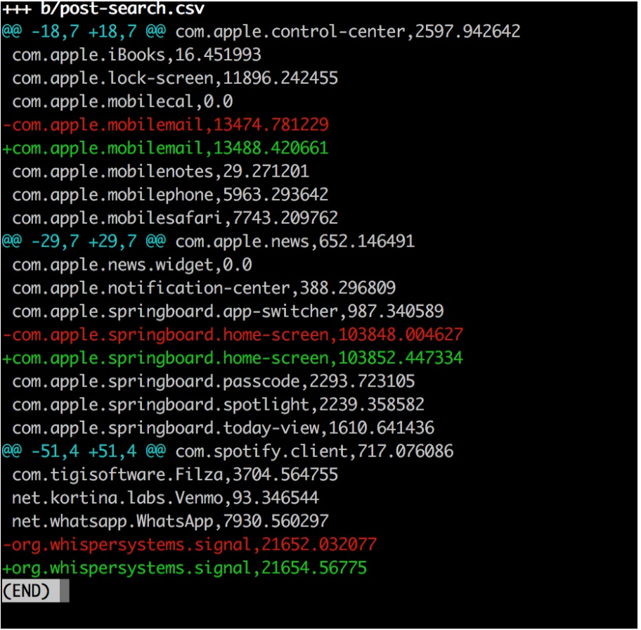

# CBP Forensics
As there seems to be no formal procedure for electronic media searches, much of our understanding about what actions CBP performs on a device in their custody comes from personal accounts of border searches. In some cases CBP may perform a cursory scan, a spot check where the agent looks through your device in front of you. Other times, as in the case with Aaron Gach, the search occurs in secret – out of site from the individual whose device is seized. Publicly available documents detailing the technological capacity of CBP even suggest that border agents will use specialized technology like Cellibrite’s UFED ( The Universal Forensic Extraction Device ) to extract call logs, application data, and other sensitive personal information. Because it’s difficult to know for certain what a border agent has done with your device, we put together a few recommendations to help you analyze CBP activity.

# Determining Activity by Logs and Power

Under the hood of your device is an ecosystem of diagnostic tools that enable the smooth operation of day to day activities. These tools require a variety of data that your phone is constantly collecting without your knowledge. There are databases of all of the wifi-hotspots your phone has ever encountered, a table detailing all of the cell towers your device has been exposed to, even a step counter that details your footsteps in a given day. All of this data is available to the operating system in order to seamlessly help you navigate your life in a ways that you have become comfortable with.
With proper access, this information can be used to determine device activity when it is not in your possession. We have written scripts for the iPhone and Android that can facilitate the process of retrieving and comparing logs of activity usage from directly before and after a device seizure. Our methodology is imperfect, but with enough foresight it can be used to archive CBP device activity.
## iPhone
All of the battery and power usage information (including approximately how much power applications and certain system processes use over time) is stored in a database called CurrentPowerlog.sql. This data is typically used to inform the calculation of battery percentage and to unmask power-hungry applications. However through this database it is also possible to see what new processes have begun while a phone was in the hands of CBP. Furthermore it is also possible to measure the approximate time CBP may have spent on an application by comparing a dump of this database from before and after a search.
### iMar-a-logo Script
We wrote a script to facilitate the process of analyzing application usage on an iPhone. On a rooted device connected to the network, this iMar-a-logo script will take an application usage snapshot pre-search and post-search in order to compare the output. The script will ask for an IP address to connect to, find the currentPowerLog database, and export the relevant table to a csv on your local machine. The script will then run a comparison on the two snapshots to determine device activity.
1. To obtain an initial snapshot of device activity, first run the iMar-a-loggo script with the -pre flag. This must be done before a device seizure in order to have a point of comparison.
`./iMar-a-logo -pre`
2. Now make sure to close out of all applications and to do as little as you can with your device in the time leading up to suspected device seizure. The best strategy is to turn off your device.
 3. Upon receiving your device from CBP,you may want to check to see if they have forgotten to close out of applications. Take screenshots if so.
5. Now turn off your device.
6. When you are in a safe place with a secure network connection run the iMar-a-logo.sh script again with a -post flag. This will take another device snapshot and compare it to the pre-search snapshot: `./iMar-a-logo -post`
7. The output will look like this:
  

Above you can see that Signal and Mobile Mail were opened in the time where I was not in possession of my phone.
### iPhone Disclaimer

On an iPhone the iMar-a-logo script requires the user to jailbreak their phone. This is not necessarily a trivial task, and the process varies from device to device. TODO: write howto
## Android
On an Android device it is possible to detect device activity by comparing application usage stats. Unlike on an iPhone, root permissions are not required to see this type of system information. Our android-a-logo script facilitates this process. Follow the above steps, replacing iMar-a-logo.sh with `android-a-logo`.

## Requesting data on third party servers
Each time your device requests information from a third party, it will reach out to a remote server on the internet. The server, managed by the company whose application you are accessing, likely will retain a log of the time and IP address of your request. Some major services offer a measure of transparency by allowing their users to request their personal records. Using these services it is possible to determine whether or not CBP accessed an application while they were in possession of a device. To accurately determine this, there are a few steps to should take.
1. Turn off your device before approaching CBP.
2. Take note of the time your device is seized.
3. When receiving the device back from CBP try no tto open applications.
4. When in a safe place,use your computer to request information from third party servers. Below we detail how to do this, and what to look for.
### Facebook
Facebook will provide detailed activity logs of a user’s session events. A session event can be a login, logout, or an update. To request your data log into Facebook and click the down arrow in the far right of the blue header. Click on settings. On the bottom of the General Account Settings page you will see a small blue link to “Download a copy of your Facebook data”.

When you receive your Facebook data open the index.html file and click on the Security tab in the left hand navigation. This will show you Active Sessions and Account Activity.

#### Active Sessions
This category details the browser and operating system of every active Facebook session. Specifically you can find out when the session was created (the date and time you logged in), and the last time the session was updated (the date and time you last accessed your open session on that device). It also logs your IP and browser data.
#### Account Activity
This is a more detailed log of all of the logins and updates. The “Login” bullets will tell you when an open session was created. The “Session Updated” bullets will tell you when an open session was accessed. The “Web Session Terminated” will tell you when a session was closed.
### Twitter
Twitter provides it’s users with a similar set of data. To request data log in to twitter, click on the small circular photograph of your profile picture, and find the “Settings and privacy” down. On the left hand side of the general account information page find the link for “Your Twitter data”. Scroll to the bottom of the page and click “Request your data”. Twitter will prepare an archive and send it to the email address they have on file.

In the PDF that Twitter provides there will be a historical snapshot of App logins. When a device is turned on and subsequently opens Twitter a new record is created. Look for a record that corresponds to the time a phone was in CBP custody.

## iOS and Android Cellular Data Usage Statistics

In most cases when you open an application on your smart phone some amount of data is sent to a server and back. By comparing the a snapshot of your data before and after a CBP seizure you can determine what applications used data in the time you didnt have your phone.

The first thing to do is reset your statistics right before you go approach CBP. On an Iphone this is located in: `Settings > Cellular > Reset Statistics. On an Android: Navigate to Settings > Wireless & Networks > Data Usage`

 
 